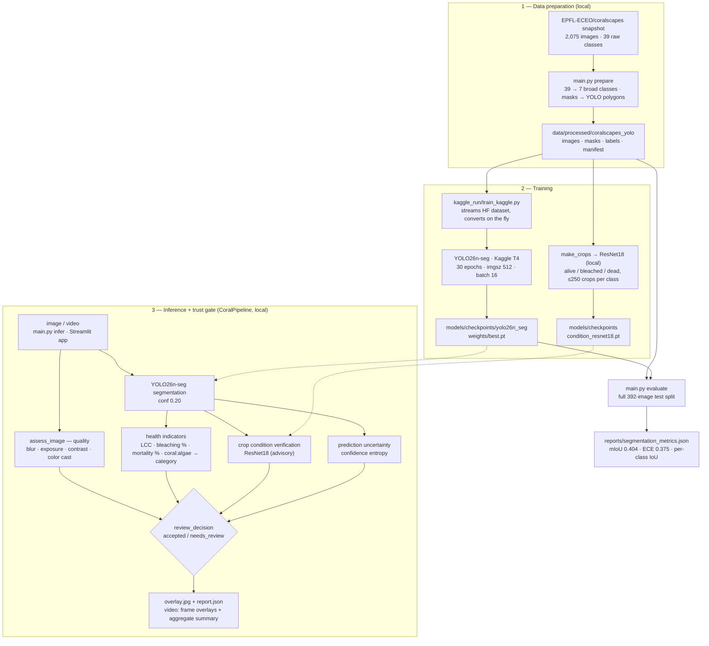

# Trustworthy AI-Assisted Coral Reef Health Assessment

A reproducible image/video workflow for visible benthic composition and coral-condition indicators. Every result carries image-quality checks, predicted coverage, confidence/uncertainty signals, and an explicit `accepted` or `needs_review` state.

Scope: quantitative visible benthic composition and coral-condition indicators with automated reliability verification.

---

## Table of contents

1. [Quick start](#quick-start)
2. [Architecture](#architecture)
3. [Current artifacts](#current-artifacts)
4. [Dataset](#dataset)
5. [Entry point: `main.py`](#entry-point-mainpy)
6. [Data preparation](#data-preparation)
7. [Training (Kaggle Cloud Workflow)](#training-kaggle-cloud-workflow)
8. [Condition classifier](#condition-classifier)
9. [Evaluation](#evaluation)
10. [Inference & reef health pipeline](#inference--reef-health-pipeline)
11. [Trust / reliability gate](#trust--reliability-gate)
12. [Overlay and video aggregation](#overlay-and-video-aggregation)
13. [Streamlit UI](#streamlit-ui)
14. [Repository layout](#repository-layout)
15. [Reproducibility record](#reproducibility-record)

---

## Quick start

### A. Use the trained checkpoints

Both models are tracked in git (`models/checkpoints/yolo26n_seg/weights/best.pt` and `models/checkpoints/condition_resnet18.pt`), so a fresh clone can run inference immediately:

```bash
python -m pip install -r requirements.txt

# Single image (writes overlay.jpg + report.json to outputs/inference/)
python main.py infer --image path/to/image.jpg

# Video
python main.py infer --video path/to/video.mp4 --out outputs/video_analysis

# Streamlit UI
python main.py app
```

The condition classifier is loaded automatically (override with `--condition-model`).

### B. Full setup (reproduce the artifacts)

The dataset and prepared data are **not tracked in git** (too large), so they must be downloaded and regenerated. The trained weights are already present from the clone, so steps 3–4 are only needed to *retrain*.

```bash
python -m pip install -r requirements.txt

# 1. Download the Coralscapes snapshot (5.86 GB)
hf download EPFL-ECEO/coralscapes --repo-type dataset --local-dir datasets/coralscapes_hf

# 2. Prepare the YOLO-format dataset (images, masks, polygon labels, manifest)
python main.py prepare

# 3. Retrain segmentation on Kaggle (optional — committed weights are used otherwise)
kaggle kernels push -p kaggle_run/
kaggle kernels output <your-kaggle-username>/coral-btp-train -p kaggle_results/
cp kaggle_results/checkpoints/yolo26n_full/weights/best.pt models/checkpoints/yolo26n_seg/weights/best.pt

# 4. Retrain the condition classifier (optional — exact values used for the committed checkpoint)
python main.py train-condition --per-class 250 --epochs 1 --batch 32

# 5. Evaluate on the full 392-image held-out test split → reports/segmentation_metrics.json
python main.py evaluate

# 6. Sample inference (reproduces outputs/final_sample/)
python main.py infer --image data/processed/coralscapes_yolo/images/test/test_000000.png --out outputs/final_sample
```

Details: step 3 → [Training (Kaggle Cloud Workflow)](#training-kaggle-cloud-workflow), step 4 → [Condition classifier](#condition-classifier), step 5 → [Evaluation](#evaluation).

## Architecture

Three stages: local data preparation, cloud (Kaggle) training, and a local inference pipeline guarded by the trust/reliability gate.



## Current artifacts

- **Active segmentation checkpoint**: `models/checkpoints/yolo26n_seg/weights/best.pt`
  - Kaggle T4, 30 epochs, imgsz 512, batch 16, full Coralscapes training set (1,517 train images)
  - Mask mAP50 ≈ 0.165 on the val split (from `models/checkpoints/yolo26n_seg/results.csv`)
  - Operating mIoU ≈ 0.404 at conf 0.20 on the full 392-image test split, with Expected Calibration Error ECE ≈ 0.375
- **Condition classifier**: `models/checkpoints/condition_resnet18.pt`
  - ResNet18, evaluated on coral crops (live, bleached, dead) for secondary condition verification
- **Evaluation report**: `reports/segmentation_metrics.json` — full 392-image test split at conf 0.20 (mIoU ≈ 0.404, ECE ≈ 0.375; per-class IoU, confusion matrix, binned calibration stats)
- **Training record**: `reports/training_run.json`
- **Prepared dataset**: 2,075 images (train/val/test = 1,517/166/392), generated by `main.py prepare` → `data/processed/coralscapes_yolo/` (not tracked in git)

## Dataset

- Source: `EPFL-ECEO/coralscapes` (Coralscapes, ICCVW 2025)
  - Canonical snapshot: `datasets/coralscapes_hf/` (5.86 GB, Parquet format) — not tracked in git
  - Download: `hf download EPFL-ECEO/coralscapes --repo-type dataset --local-dir datasets/coralscapes_hf`
- 39 raw classes mapped to 7 broad visible classes (`coral_alive`, `coral_bleached`, `coral_dead`, `algae`, `rubble`, `sand_rock`, `other`) — logic in `src/data/label_map.py`

## Entry point: `main.py`

Every command-line workflow is funneled through `main.py`:

```bash
python main.py prepare [--root DATASETS_HF] [--out PROCESSED] [--max-images-per-split N] [--copy-images]
python main.py evaluate [--model CKPT] [--manifest ...] [--raw-classes ...] [--max-images N] [--conf ...] [--out ...]
python main.py infer [--model CKPT] [--condition-model CKPT] [--image IMG | --video VID] [--out DIR] [--imgsz 512] [--conf ...]
python main.py train-condition [--manifest ...] [--raw-classes ...] [--crops ...] [--checkpoint ...] [--per-class N] [--epochs N] [--batch N]
python main.py app [--port 8501]
```

`--model` defaults to the active checkpoint `models/checkpoints/yolo26n_seg/weights/best.pt` for both `evaluate` and `infer`.

- `prepare` calls `src/data/prepare.py:prepare()` — converts the local HF Coralscapes snapshot into the YOLO segmentation dataset (manifest.csv, data.yaml, label_map.json, classes.json, YOLO polygon labels).
- `evaluate` calls `src/evaluate/segmentation.py:evaluate()` — per-class IoU, mIoU, confusion matrix.
- `infer` calls `src/inference/pipeline.py:CoralPipeline` for image or video, writes overlay + JSON report.
- `train-condition` calls `src/models/train_condition.py:make_crops()` + `train_condition()` — crop extraction + ResNet18 training; condition classifier checkpoint exists at `models/checkpoints/condition_resnet18.pt`.
- `app` launches `src/app/streamlit_app.py` as a Streamlit sub-process.

Training itself no longer runs in a local script; it is the Kaggle kernel defined in `kaggle_run/`. Nothing under `scripts/` remains.

## Data preparation

Entry point: `python main.py prepare` → `src/data/prepare.py:prepare()`

Reads `id2label.json` and split Parquet files directly from `datasets/coralscapes_hf/data/{train,validation,test}-*.parquet`. Each sample row decodes RGB image bytes and segmentation mask bytes:
- For each sample, it produces:
  - `data/processed/coralscapes_yolo/images/<split>/<stem>.png` (RGB image)
  - `data/processed/coralscapes_yolo/masks/<split>/<stem>.png` (Raw class mask)
  - `data/processed/coralscapes_yolo/labels/<split>/<stem>.txt` (Normalized YOLO segmentation polygons preserving native aspect ratio)
- Automatically emits:
  - `manifest.csv` (Sample index with paths, split, and polygon counts)
  - `data.yaml` (Ultralytics dataset configuration)
  - `label_map.json` (Raw 39-class to 7-broad-class dictionary)
  - `classes.json` (Class mapping for condition classification)

Label conversion: `raw_to_broad` collapses raw classes into 7 visible categories (`coral_alive`, `coral_bleached`, `coral_dead`, `algae`, `rubble`, `sand_rock`, `other`); background/dark pixels are assigned to 255 (ignored).

## Training (Kaggle Cloud Workflow)

Segmentation training runs **only** on Kaggle: the free Tesla T4 (16 GB VRAM) trains YOLO26n-seg on 1,517 images for 30 epochs in ~1.5 hours, where consumer 4 GB GPUs risk CUDA OOM and take 20+ hours. Everything else — preparation, evaluation, inference, trust gate, dashboard — runs locally, and once `best.pt` is downloaded to `models/checkpoints/yolo26n_seg/weights/best.pt`, no further Kaggle compute is needed.

**Kernel files** (`kaggle_run/`):

- `train_kaggle.py` — standalone remote script: installs `ultralytics`/`datasets`/`huggingface_hub`, downloads `id2label.json` and maps the 39 raw classes to the 7 broad categories, streams the HF dataset split-by-split and converts masks to YOLO polygons (`cv2.findContours` + `cv2.approxPolyDP`) under `/kaggle/working/coralscapes_yolo_hf/`, writes `data.yaml`, then trains from base weights `yolo26n-seg.pt` with mixed precision:

  ```python
  model.train(data="/kaggle/working/coralscapes_yolo_hf/data.yaml", epochs=30, imgsz=512,
              batch=16, device=0, workers=2, project="/kaggle/working/checkpoints",
              name="yolo26n_full", patience=10, plots=True)
  ```

  Weights (`best.pt`, `last.pt`), curves, and `results.csv` are exported to `/kaggle/working/checkpoints/yolo26n_full/`.
- `kernel-metadata.json` — kernel runner config (GPU `NvidiaTeslaT4`, internet on, private script). Update `"id"` to `<your-kaggle-username>/coral-btp-train`; field reference in the [Kaggle API docs](https://github.com/Kaggle/kaggle-api).

**Retrain from scratch** (Kaggle CLI install + API token setup: [Kaggle API docs](https://github.com/Kaggle/kaggle-api)):

```bash
kaggle kernels push -p kaggle_run/                                 # queue the T4 run
kaggle kernels status <your-kaggle-username>/coral-btp-train       # poll until complete
kaggle kernels logs <your-kaggle-username>/coral-btp-train         # stream training output
kaggle kernels output <your-kaggle-username>/coral-btp-train -p kaggle_results/
cp kaggle_results/checkpoints/yolo26n_full/weights/best.pt models/checkpoints/yolo26n_seg/weights/best.pt
```

After the handoff, everything continues locally — `python main.py evaluate`, `python main.py infer`, `python main.py app` (see [Quick start](#quick-start)).

---

## Condition classifier

Checkpoint: `models/checkpoints/condition_resnet18.pt` — torchvision ResNet18 trained
from scratch on 128×128 crops sampled from the Coralscapes masks (`coral_alive`,
`coral_bleached`, `coral_dead`).

The current checkpoint was produced with (all defaults):

```bash
python main.py train-condition --per-class 250 --epochs 1 --batch 32
```

which runs `make_crops()` then `train_condition()`, both in `src/models/train_condition.py`:

- `make_crops()` draws up to 2 crops per image per class from the segmentation masks,
  capped at 250 crops per class per split (seed 42) → 450 train / 382 val crops under
  `data/processed/condition_crops/`.
- `train_condition()` trains ResNet18 from scratch with AdamW (lr 1e-3,
  weight decay 1e-4) on 128×128 inputs.

Current performance is modest — macro F1 ≈ 0.23, balanced accuracy ≈ 0.34 on the 382
validation crops, with `coral_dead` never predicted correctly (full metrics in
`reports/training_run.json`). Its crop-level votes are therefore treated as an
advisory signal alongside the segmentation masks, not as ground truth.

Full option set: `python main.py train-condition [--manifest ...] [--raw-classes ...] [--crops ...] [--checkpoint ...] [--per-class N] [--epochs N] [--batch N]`.

## Evaluation

Entry point: `python main.py evaluate` → `src/evaluate/segmentation.py:evaluate()`

For each row in `manifest.csv` (filtered to `split == "test"`, optionally truncated by `--max-images N`):

1. Load the image with cv2 and the raw mask via `broad_mask()` to get broad ground-truth class IDs.
2. Predict with Ultralytics at `imgsz=512` matching the model training resolution.
3. Produce a confusion matrix: unsegmented valid pixels are mapped to `other` to account for recall.
4. Compute per-class IoU, mean IoU (mIoU), and Expected Calibration Error (ECE) across detection confidences.

Report schema: `images`, `confidence_threshold`, `mIoU`, `per_class_iou`, `calibration` (binned reliability stats), and `confusion_matrix`.

The current report was produced with (full 392-image test split, conf 0.20):

```bash
python main.py evaluate
```

`--max-images N` is only a pipeline smoke test: it takes the *first N manifest rows* (not a random sample), whose composition is atypical, so subset metrics are not representative and should not be quoted as model performance.

## Inference & reef health pipeline

`src/inference/pipeline.py` (`CoralPipeline`):

- `__init__(model_path, condition_model_path=None, imgsz=512, conf=0.20, thresholds=None)`:
  - Loads YOLO26 instance segmentation checkpoint.
  - Optionally loads ResNet-18 condition classifier (`models/checkpoints/condition_resnet18.pt`) for crop-level condition verification.
- `infer(image_path, save_overlay=None)`:
  - `assess_image()` computes blur, brightness, contrast, and color-cast quality signals.
  - `model.predict` generates segmentation masks, bounding boxes, classes, and confidence scores.
  - Computes **Quantitative Ecological Health Indicators**:
    - **Live Coral Cover (LCC %)**: Primary ecological benthic health metric.
    - **Bleaching Prevalence Ratio (%)**: $\frac{\text{bleached}}{\text{total coral}} \times 100\%$.
    - **Coral Mortality Ratio (%)**: $\frac{\text{dead}}{\text{total coral}} \times 100\%$.
    - **Macroalgal Competition**: Coral-to-Algae ratio and algal cover.
    - **Reef Health Category**: Gomez / Reef Check standard tiers (*Excellent* $\ge 50\%$, *Good* $25-50\%$, *Fair* $10-25\%$, *Poor/Degraded* $< 10\%$).
  - Evaluates coral crops through the ResNet-18 condition classifier (when loaded) for crop-level verification.
  - `prediction_uncertainty()` evaluates binary entropy across detection confidences.
  - `review_decision()` transparently determines `accepted` vs `needs_review` status.
  - Annotates overlay image and saves comprehensive JSON report.
- `infer_video()`: extracts frames, computes health metrics per frame, and produces an aggregated video survey report.

## Trust / reliability gate

`src/trust/reliability.py`:

- `expected_calibration_error(confidence, correct, bins=10)`: Computes ECE and binned calibration metrics.
- `softmax(logits, temperature)`: Temperature-scaled probabilities for post-hoc calibration.
- `prediction_uncertainty(scores)`: Normalized entropy over detection confidence scores (avoids penalizing diverse reef compositions).
- `review_decision(quality, confidence, coverage, uncertainty, thresholds)`:
  - Transparently checks image quality flags (`blur`, `exposure`, `low_contrast`, `color_cast`).
  - Evaluates prediction reliability (`low_confidence`, `low_predicted_coverage`, `high_uncertainty`).
  - Emits explicit status (`accepted` or `needs_review`) with detailed flag audit trail.

Quality: `src/data/quality.py::assess_image` checks Laplacian-blur variance, brightness mean, contrast stddev, channel max/min color cast; scoring drops the quality score for each present flag and sets `needs_review` status when flags appear.

## Overlay and video aggregation

Overlay drawing happens inline in `CoralPipeline.infer()` (`src/inference/pipeline.py`):

1. **Mask blend**: each predicted mask region is blended `0.55 * image + 0.45 * class_color`.
2. **Boxes + labels**: each instance box is drawn in its class color; label text `class_name score` above each box, with a `[condition]` suffix appended when the crop classifier evaluated that instance. `fs` (font scale) = `max(0.45, min(1.2, width/1200.0))`, `bt` (thickness) = `max(1, round(width/600))`.
3. **Top-left HUD panel**: reef health category, LCC / bleached / algae cover percentages, trust status with coverage % and mean confidence, plus a flags line when reliability reasons are present — on a semi-transparent dark panel (50/50 blend) of width `max(420, width * 0.42)`.

Manual: the same overlay is reused for video by `infer_video()`. Per-frame overlays are `frame_NNNNNN_overlay.jpg` in the output dir; aggregate JSON has `sampled_frames`, framewise `frames`, and `summary` with mean composition and status across accepted frames (or all frames if none accepted).

## Streamlit UI

`src/app/streamlit_app.py`:

- Available image types: `jpg/jpeg/png`; video types: `mp4/avi/mov/mkv`.
- Two-pane width layout for images (input/overlay side-by-side, 500 px each).
- Video: `every_n` slider (5–60, default 15) and `max_frames` slider (4–60, default 12), spinner while running; shows `accepted_frames/total_frames` status banner, video-level summary JSON, up to 6 overlay frames (small grid), and the full per-frame report + download button.
- After `upload`: writes the bytes to a temp dir, invokes `CoralPipeline`, displays the overlay(s), saves the JSON report for `st.download_button`.

## Repository layout

Markers: **✓ tracked** in git · **✗ not tracked** — downloaded or generated via [Quick start](#quick-start) path B.

```
BTP/
├── README.md                             ✓ this file
├── requirements.txt                      ✓ Python dependencies
├── main.py                               ✓ single CLI entrypoint: prepare · evaluate · infer · train-condition · app
├── src/                                  ✓ all pipeline code
│   ├── data/        label_map.py · prepare.py · quality.py   # 39→7 label map · dataset build · image-quality checks
│   ├── models/      train_condition.py                       # crop extraction + ResNet18 condition training
│   ├── evaluate/    segmentation.py                          # test-split mIoU · per-class IoU · ECE · confusion matrix
│   ├── inference/   pipeline.py                              # CoralPipeline: quality → segmentation → health → trust gate
│   ├── trust/       reliability.py                           # ECE · temperature scaling · entropy · review_decision
│   └── app/         streamlit_app.py                         # dashboard (main.py app)
├── configs/labels.yaml                   ✓ 7 broad classes + ignored raw classes
├── kaggle_run/                           ✓ cloud GPU job (train_kaggle.py · kernel-metadata.json)
│
├── models/checkpoints/                   ✓ trained weights + training curves
│   ├── yolo26n_seg/                      #   weights/best.pt · last.pt · args.yaml · results.csv/png · PR & F1 curves
│   └── condition_resnet18.pt             #   ResNet18 checkpoint for crop-level condition verification 
├── reports/                              ✓ evaluation reports + training record
│   ├── segmentation_metrics.json         #   full 392-image test-split eval
│   └── training_run.json                 #   training params · environment · classifier metrics
├── project/                              ✓ decision docs · dataset-inventory.md · paper-inventory.md
│
├── datasets/coralscapes_hf/              ✗ HF snapshot, 5.86 GB parquet          ← path B, step 1
├── data/processed/                       ✗ generated by prepare / train-condition  ← path B, steps 2 & 4
│   ├── coralscapes_yolo/                 #   images · masks · labels · manifest.csv · data.yaml · label_map.json
│   └── condition_crops/                  #   ResNet18 train/val crops
├── outputs/                              ✗ inference results (overlays + JSON reports)
└── papers/                               ✗ reference PDFs — index: project/paper-inventory.md

```

## Reproducibility record

`reports/training_run.json` documents the training parameters and environment:

```json
{
  "project": "Trustworthy AI-Assisted Coral Reef Health Assessment",
  "dataset": {"name":"Coralscapes","prepared_manifest":"...","images":2075,"by_split":{...},"classes":"configs/labels.yaml"},
  "segmentation": {"architecture":"Ultralytics YOLO26n-seg","checkpoint":"models/checkpoints/yolo26n_seg/weights/best.pt","trainer":"Kaggle T4","device":"T4 x2","epochs":30,"imgsz":512,"batch":16,"operating_confidence":0.20,"metrics_mAP50_mask":0.1652},
  "evaluation_reports":["reports/segmentation_metrics.json"]
}
```

## Operational summary

- The Hugging Face Parquet snapshot (`datasets/coralscapes_hf/`) is the canonical dataset source.
- The Kaggle T4 checkpoint at `models/checkpoints/yolo26n_seg/weights/best.pt` is the active segmentation model.
- Segmentation model training runs on Kaggle GPU, while data preparation, evaluation, inference, and the interactive dashboard execute locally.
